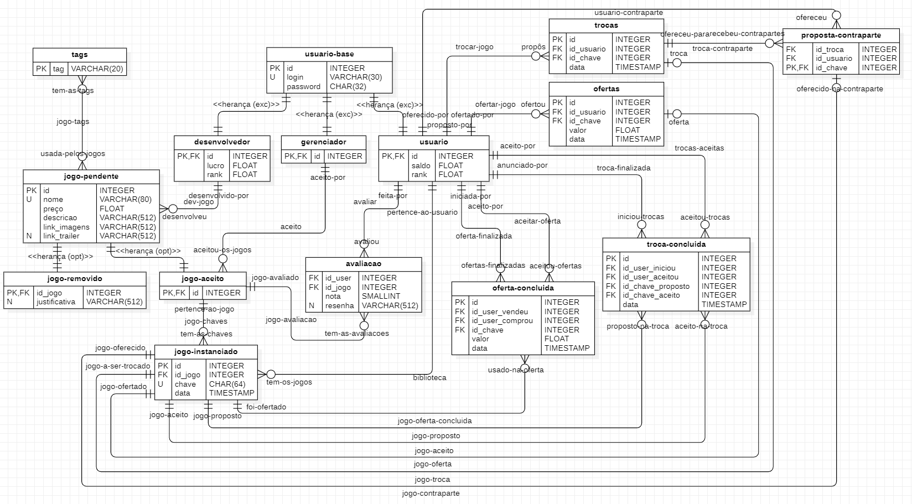

# Modelo dos dados

- [Modelo dos dados](#modelo-dos-dados)
  - [Introdução](#introdução)
  - [Diagrama ER](#diagrama-er)
    - [Restrições ocultas](#restrições-ocultas)
    - [Observações](#observações)
  - [Uso esperado](#uso-esperado)
  - [Dicionário de dados e mapeamento](#dicionário-de-dados-e-mapeamento)
    - [Mapeamento de entidades](#mapeamento-de-entidades)
      - [usuario\_base](#usuario_base)
      - [desenvolvedor](#desenvolvedor)
      - [gerenciador](#gerenciador)
      - [usuario](#usuario)
      - [tags](#tags)
      - [jogo\_pendente](#jogo_pendente)
      - [jogo\_aceito](#jogo_aceito)
      - [jogo\_removido](#jogo_removido)
      - [jogo\_instanciado](#jogo_instanciado)
      - [avaliacao](#avaliacao)
      - [ofertas](#ofertas)
      - [oferta\_concluida](#oferta_concluida)
      - [trocas](#trocas)
      - [proposta\_contraparte](#proposta_contraparte)
      - [troca\_concluida](#troca_concluida)
    - [Mapeamento de relações](#mapeamento-de-relações)
      - [jogo-tags](#jogo-tags)
      - [biblioteca](#biblioteca)
      - [dev-jogo](#dev-jogo)
      - [aceito](#aceito)
      - [avaliar](#avaliar)
      - [jogo-avaliacao](#jogo-avaliacao)
      - [oferta-finalizada](#oferta-finalizada)
      - [aceitar-oferta](#aceitar-oferta)
      - [troca-finalizada](#troca-finalizada)
      - [trocas-aceitas](#trocas-aceitas)
      - [ofertar-jogo](#ofertar-jogo)
      - [trocar-jogo](#trocar-jogo)
      - [usuario-contraparte](#usuario-contraparte)
      - [jogo-chaves](#jogo-chaves)
      - [jogo-oferta-concluida](#jogo-oferta-concluida)
      - [jogo-proposto](#jogo-proposto)
      - [jogo-aceito](#jogo-aceito)
      - [jogo-oferta](#jogo-oferta)
      - [jogo-troca](#jogo-troca)
      - [jogo-contraparte](#jogo-contraparte)
  - [Views](#views)
    - [media\_avaliacao](#media_avaliacao)
  - [Consistência de dados](#consistência-de-dados)
    - [Checks](#checks)
      - [avaliacao](#avaliacao-1)
      - [ofertas](#ofertas-1)
      - [oferta\_concluida](#oferta_concluida-1)
      - [troca\_concluida](#troca_concluida-1)
    - [Triggers](#triggers)
      - [T1: Aumento do saldo da conta do usuário eleva seu rank](#t1-aumento-do-saldo-da-conta-do-usuário-eleva-seu-rank)
      - [T2: Jogo recusado não pode ser aceito](#t2-jogo-recusado-não-pode-ser-aceito)
      - [T3: Impede que jogos sejam aceitos se não tem tags correspondentes](#t3-impede-que-jogos-sejam-aceitos-se-não-tem-tags-correspondentes)
      - [T4: Impede novas instâncias de jogos removidos de serem geradas](#t4-impede-novas-instâncias-de-jogos-removidos-de-serem-geradas)
      - [T5: Impede que instâncias de jogos ainda não aceitos sejam geradas](#t5-impede-que-instâncias-de-jogos-ainda-não-aceitos-sejam-geradas)
      - [T6: Atualiza rank do desenvolvedor assim que uma avaliação for criada](#t6-atualiza-rank-do-desenvolvedor-assim-que-uma-avaliação-for-criada)
      - [T7: Atualiza rank do desenvolvedor assim que uma avaliação for apagada](#t7-atualiza-rank-do-desenvolvedor-assim-que-uma-avaliação-for-apagada)
      - [T8: Atualiza rank do desenvolvedor assim que uma avaliação for atualizada](#t8-atualiza-rank-do-desenvolvedor-assim-que-uma-avaliação-for-atualizada)
      - [T9: Preço de venda do usuário deve estar entre 50% e 150% do preço original](#t9-preço-de-venda-do-usuário-deve-estar-entre-50-e-150-do-preço-original)
      - [T10: Oferta apenas jogos da biblioteca](#t10-oferta-apenas-jogos-da-biblioteca)
      - [T11: Remove da biblioteca a chave que será usada em oferta](#t11-remove-da-biblioteca-a-chave-que-será-usada-em-oferta)
      - [T12: Readiciona chave à biblioteca do usuário](#t12-readiciona-chave-à-biblioteca-do-usuário)
      - [T13: Permite que oferta seja concluída paenas se usuário tem saldo suficiente](#t13-permite-que-oferta-seja-concluída-paenas-se-usuário-tem-saldo-suficiente)
      - [T14: Garante que a oferta existe e é válida](#t14-garante-que-a-oferta-existe-e-é-válida)
      - [T15: Insere a chave do jogo comprado na oferta na biblioteca do usuário que comprou](#t15-insere-a-chave-do-jogo-comprado-na-oferta-na-biblioteca-do-usuário-que-comprou)
      - [T16: Altera lucro do desenvolvedor no caso de oferta de jogo não removido](#t16-altera-lucro-do-desenvolvedor-no-caso-de-oferta-de-jogo-não-removido)
      - [T17: Atualiza rank do desenvolvedor assim que uma avaliação for atualizada](#t17-atualiza-rank-do-desenvolvedor-assim-que-uma-avaliação-for-atualizada)
      - [T18: Impede que o usuário faça uma proposta para si mesmo](#t18-impede-que-o-usuário-faça-uma-proposta-para-si-mesmo)
      - [T19: Jogo que não está mais sendo proposto para troca deve voltar à biblioteca do usuário](#t19-jogo-que-não-está-mais-sendo-proposto-para-troca-deve-voltar-à-biblioteca-do-usuário)
      - [T20: Remove jogo da biblioteca do usuário após ter sido proposto para troca](#t20-remove-jogo-da-biblioteca-do-usuário-após-ter-sido-proposto-para-troca)
      - [T21: Troca apenas jogos da biblioteca](#t21-troca-apenas-jogos-da-biblioteca)
      - [T22: Remove da biblioteca a chave que será usada na troca](#t22-remove-da-biblioteca-a-chave-que-será-usada-na-troca)
      - [T23: Readiciona chave à biblioteca do usuário](#t23-readiciona-chave-à-biblioteca-do-usuário)
      - [T24: Garante que a troca existe e é válida](#t24-garante-que-a-troca-existe-e-é-válida)
      - [T25: Jogo aceito pela troca deve estar na lista de proposta](#t25-jogo-aceito-pela-troca-deve-estar-na-lista-de-proposta)
      - [T26: Faz swap das chaves que fazem parte da troca](#t26-faz-swap-das-chaves-que-fazem-parte-da-troca)
      - [T27: Verifica se usuário tem jogo na biblioteca antes de avaliá-lo](#t27-verifica-se-usuário-tem-jogo-na-biblioteca-antes-de-avaliá-lo)

<div style="page-break-after: always;"></div>

## Introdução

Segue neste documento o diagrama entidade-relacionamento e seu mapeamento que define a modelagem dos dados que serão usados no banco de dados gerenciado pelo DB Manager.

## Diagrama ER



### Restrições ocultas

* (E) proposta-contraparte: UNIQUE(id_usuario, id_chave);
* (E) trocas: UNIQUE(id_usuario, id_chave);
* (E) ofertas: UNIQUE(id_usuario, id_chave);
* (E) troca-concluida: NOT EQUAL(id_user_iniciou, id_user_aceitou);
* (E) oferta-concluida: NOT EQUAL(id_user_vendeu, id_user_comprou);
* (E) avaliacao: UNIQUE(id_usuario, id_jogo);

### Observações

O campo `<<herança (exc)>>` em usuario_base indica que só poderá ser usado suas especializações e usuario_base só pode ser expandido exclusivamente para uma das possiblidades: `desenvolvedor`, `gerenciador` ou `usuario`.

O campo `<<herança (opt)>>` em jogo_pendente indica que poderá ou não ser especializado.

Um jogo que já tenha especialização em jogo_removido não pode se especializar também para jogo_aceito, garantido pelo trigger [T2](#t2-jogo-recusado-não-pode-ser-aceito).

Um jogo removido não aceitará novas instâncias, atentido pelo trigger [T4](#t4-impede-novas-instâncias-de-jogos-removidos-de-serem-geradas).

Um jogo removido que tenha chaves poderá ser usado nas vendas de usuário para usuário, nesse caso não haverá mais taxa, essa restrição está sendo atentida pelo trigger [T16](#t16-altera-lucro-do-desenvolvedor-no-caso-de-oferta-de-jogo-não-removido).

Um jogo aceito pode se tornar removido, o controle deverá garantir que se o pedido é feito apartir de um gerenciador, será preenchido o campo de justificativa e no caso de ser o próprio desenvolvedor o campo deverá se manter vazio.

## Uso esperado

Por mais que o controle possa fazer verificações sobre a corretude das requisições, foi optado por definir algumas restrições na própria modelagem por meio de triggers que assegurem as pré e pós condições semânticas dos dados, i.e. quando uma troca for finalizada, todas outras chaves propostas devem retornar aos usuários antigos \[[T23](#t23-readiciona-chave-à-biblioteca-do-usuário)\].

Verificações sobre permissão ao acesso de determinadas queries é papel do controlador, DB Manager fornecerá métodos que se comunicam com o banco de dados SQLite3 que estará em memória.

## Dicionário de dados e mapeamento

### Mapeamento de entidades

#### usuario_base

```SQL
CREATE TABLE IF NOT EXISTS usuario_base (
    id INTEGER PRIMARY KEY AUTOINCREMENT,
    login VARCHAR(30) NOT NULL,
    password CHAR(32) NOT NULL,
    UNIQUE(login)
);
```

#### desenvolvedor

```SQL
CREATE TABLE IF NOT EXISTS desenvolvedor (
    id INTEGER,
    lucro FLOAT NOT NULL DEFAULT 0,
    rank FLOAT NOT NULL DEFAULT 0,
    PRIMARY KEY(id),
    FOREIGN KEY(id) REFERENCES usuario_base(id)
);
```

#### gerenciador

```SQL
CREATE TABLE IF NOT EXISTS gerenciador (
    id INTEGER,
    PRIMARY KEY(id),
    FOREIGN KEY(id) REFERENCES usuario_base(id)
);
```

#### usuario

```SQL
CREATE TABLE IF NOT EXISTS usuario (
    id INTEGER,
    saldo FLOAT NOT NULL DEFAULT 0,
    rank FLOAT NOT NULL DEFAULT 0,
    PRIMARY KEY(id),
    FOREIGN KEY(id) REFERENCES usuario_base(id)
);
```

#### tags

```SQL
CREATE TABLE IF NOT EXISTS tags (
    tag VARCHAR(20),
    PRIMARY KEY(tag)
);
```

#### jogo_pendente

```SQL
CREATE TABLE IF NOT EXISTS jogo_pendente (
    id INTEGER PRIMARY KEY AUTOINCREMENT,
    id_dev INTEGER NOT NULL,
    nome VARCHAR(80) NOT NULL,
    preco FLOAT NOT NULL,
    descricao VARCHAR(512) NOT NULL,
    link_imagens VARCHAR(512) NOT NULL,
    link_trailer VARCHAR(512),
    FOREIGN KEY(id_dev) REFERENCES desenvolvedor(id),
    UNIQUE(nome)
);
```

#### jogo_aceito

```SQL
CREATE TABLE IF NOT EXISTS jogo_aceito (
    id INTEGER,
    id_gerenciador INTEGER NOT NULL,
    PRIMARY KEY(id),
    FOREIGN KEY(id) REFERENCES jogo_pendente(id),
    FOREIGN KEY(id_gerenciador) REFERENCES gerenciador(id)
);
```

#### jogo_removido

```SQL
CREATE TABLE IF NOT EXISTS jogo_removido (
    id_jogo INTEGER,
    justificativa VARCHAR(512),
    PRIMARY KEY(id_jogo),
    FOREIGN KEY(id_jogo) REFERENCES jogo_pendente(id)
);
```

#### jogo_instanciado

```SQL
CREATE TABLE IF NOT EXISTS jogo_instanciado (
    id INTEGER PRIMARY KEY AUTOINCREMENT,
    id_jogo INTEGER NOT NULL, 
    chave CHAR(64) NOT NULL DEFAULT gen_key,
    data TIMESTAMP NOT NULL DEFAULT CURRENT_TIMESTAMP,
    FOREIGN KEY(id_jogo) REFERENCES jogo_aceito(id),
    UNIQUE(chave)
);
```

#### avaliacao

```SQL
CREATE TABLE IF NOT EXISTS avaliacao (
    id_usuario INTEGER NOT NULL,
    id_jogo INTEGER NOT NULL,
    nota SMALLINT NOT NULL CHECK(nota >= 0 AND nota <= 10),
    resenha VARCHAR(512),
    FOREIGN KEY(id_usuario) REFERENCES usuario(id),
    FOREIGN KEY(id_jogo) REFERENCES jogo_aceito(id),
    UNIQUE(id_usuario, id_jogo)
);
```

#### ofertas

```SQL
CREATE TABLE IF NOT EXISTS ofertas (
    id INTEGER PRIMARY KEY AUTOINCREMENT,
    id_usuario INTEGER NOT NULL,
    id_chave INTEGER NOT NULL,
    valor FLOAT NOT NULL CHECK(valor >= 0),
    data TIMESTAMP NOT NULL DEFAULT CURRENT_TIMESTAMP,
    FOREIGN KEY(id_usuario) REFERENCES usuario(id),
    FOREIGN KEY(id_chave) REFERENCES jogo_instanciado(id),
    UNIQUE(id_usuario, id_chave)
);
```

#### oferta_concluida

```SQL
CREATE TABLE IF NOT EXISTS oferta_concluida (
    id INTEGER PRIMARY KEY,
    id_user_vendeu INTEGER NOT NULL,
    id_user_comprou INTEGER NOT NULL,
    id_chave INTEGER NOT NULL,
    valor FLOAT NOT NULL,
    data TIMESTAMP NOT NULL DEFAULT CURRENT_TIMESTAMP,
    FOREIGN KEY(id_user_vendeu) REFERENCES usuario(id),
    FOREIGN KEY(id_user_comprou) REFERENCES usuario(id),
    FOREIGN KEY(id_chave) REFERENCES jogo_instanciado(id),
    CHECK(id_user_comprou != id_user_vendeu)
);
```

#### trocas

```SQL
CREATE TABLE IF NOT EXISTS trocas (
    id INTEGER PRIMARY KEY AUTOINCREMENT,
    id_usuario INTEGER NOT NULL,
    id_chave INTEGER NOT NULL,
    data TIMESTAMP NOT NULL DEFAULT CURRENT_TIMESTAMP,
    FOREIGN KEY(id_usuario) REFERENCES usuario(id),
    FOREIGN KEY(id_chave) REFERENCES jogo_instanciado(id),
    UNIQUE(id_usuario, id_chave)
);
```

#### proposta_contraparte

```SQL
CREATE TABLE IF NOT EXISTS proposta_contraparte (
    id_troca INTEGER NOT NULL,
    id_usuario INTEGER NOT NULL,
    id_chave INTEGER NOT NULL,
    FOREIGN KEY(id_troca) REFERENCES trocas(id),
    FOREIGN KEY(id_usuario) REFERENCES usuario(id),
    FOREIGN KEY(id_chave) REFERENCES jogo_instanciado(id),
    UNIQUE(id_chave)
);
```

#### troca_concluida

```SQL
CREATE TABLE IF NOT EXISTS troca_concluida (
    id INTEGER PRIMARY KEY,
    id_user_iniciou INTEGER NOT NULL,
    id_user_aceitou INTEGER NOT NULL,
    id_chave_proposto INTEGER NOT NULL,
    id_chave_aceito INTEGER NOT NULL,
    data TIMESTAMP NOT NULL DEFAULT CURRENT_TIMESTAMP,
    FOREIGN KEY(id_user_iniciou) REFERENCES usuario(id),
    FOREIGN KEY(id_user_aceitou) REFERENCES usuario(id),
    FOREIGN KEY(id_chave_proposto) REFERENCES jogo_instanciado(id),
    FOREIGN KEY(id_chave_aceito) REFERENCES jogo_instanciado(id),
    CHECK(id_user_iniciou != id_user_aceitou)
);
```

### Mapeamento de relações

#### jogo-tags

* Criada uma tabela com id's de ambas as partes.

```SQL
CREATE TABLE IF NOT EXISTS jogo_tags (
    id_jogo INTEGER NOT NULL,
    tag VARCHAR(20) NOT NULL,
    FOREIGN KEY(id_jogo) REFERENCES jogo_pendente(id),
    FOREIGN KEY(tag) REFERENCES tags(tag),
    UNIQUE(id_jogo, tag)
);
```

#### biblioteca

* Criada uma tabela com id's de ambas as partes.

```SQL
CREATE TABLE IF NOT EXISTS biblioteca_jogos (
    id_chave INTEGER NOT NULL,
    id_usuario INTEGER NOT NULL,
    PRIMARY KEY(id_chave),
    FOREIGN KEY(id_chave) REFERENCES jogo_instanciado(id),
    FOREIGN KEY(id_usuario) REFERENCES usuario(id),
    UNIQUE(id_chave, id_usuario)
);
```

#### dev-jogo

* id do desenvolvedor foi incorporado na tabela `jogo_pendente`, no campo `id_dev`.

#### aceito

* id do gerenciador foi incorporado na tabela `jogo_aceito`, no campo `id_gerenciador`.

#### avaliar

* id do usuario foi incorporado na tabela `avaliacao`, no campo `id_usuario`.

#### jogo-avaliacao

* id do jogo foi incorporado na tabela `avaliacao`, no campo `id_jogo`.

#### oferta-finalizada

* id do usuario foi incorporado na tabela `oferta_concluida`, no campo `id_user_vendeu`.

#### aceitar-oferta

* id do usuario foi incorporado na tabela `oferta_concluida`, no campo `id_user_comprou`.

#### troca-finalizada

* id do usuario foi incorporado na tabela `troca_concluida`, no campo `id_user_iniciou`.

#### trocas-aceitas

* id do usuario foi incorporado na tabela `troca_concluida`, no campo `id_user_aceitou`.

#### ofertar-jogo

* id do usuario foi incorporado na tabela `ofertas`, no campo `id_usuario`.

#### trocar-jogo

* id do usuario foi incorporado na tabela `trocas`, no campo `id_usuario`.

#### usuario-contraparte

* id do usuario foi incorporado na tabela `proposta_contraparte`, no campo `id_usuario`.

#### jogo-chaves

* id do jogo foi incorporado na tabela `jogo_instanciado`, no campo `id_jogo`.

#### jogo-oferta-concluida

* id da chave foi incorporado na tabela `oferta_concluida`, no campo `id_chave`.

#### jogo-proposto

* id da chave foi incorporado na tabela `troca_concluida`, no campo `id_chave_proposto`.

#### jogo-aceito

* id da chave foi incorporado na tabela `troca_concluida`, no campo `id_chave_aceitou`.

#### jogo-oferta

* id da chave foi incorporado na tabela `ofertas`, no campo `id_chave`.

#### jogo-troca

* id da chave foi incorporado na tabela `trocas`, no campo `id_chave`.

#### jogo-contraparte

* id da chave foi incorporado na tabela `proposta_contraparte`, no campo `id_chave`.

## Views

### media_avaliacao

Exibe média do jogo.

```SQL
CREATE VIEW media_avaliacao AS
    SELECT jogo_aceito.id, jogo_pendente.nome, AVG(nota) AS nota
    FROM jogo_aceito
    JOIN avaliacao ON (avaliacao.id_jogo=jogo_aceito.id)
    JOIN jogo_pendente ON (jogo_aceito.id=jogo_pendente.id)
    GROUP BY jogo_aceito.id;
```

## Consistência de dados

### Checks

#### avaliacao

* A nota deve estar entre 0 e 10 (inclusivo).

#### ofertas

* Valor de oferta deve ser maior ou igual a 0.

#### oferta_concluida

* id_user_comprou != id_user_vendeu

#### troca_concluida

* id_user_iniciou != id_user_aceitou

### Triggers

#### T1: Aumento do saldo da conta do usuário eleva seu rank

```SQL
CREATE TRIGGER IF NOT EXISTS t1_update_user_rank AFTER UPDATE OF saldo ON usuario
WHEN (
    NEW.saldo > OLD.saldo
)
BEGIN
    UPDATE usuario
    SET rank = rank + (NEW.saldo - OLD.saldo)
    WHERE usuario.id=OLD.id;
END;
```

#### T2: Jogo recusado não pode ser aceito

```SQL
CREATE TRIGGER IF NOT EXISTS t2_jogo_recusado_nao_aceitavel BEFORE INSERT ON jogo_aceito
WHEN (
    NEW.id IN (SELECT jogo_removido.id_jogo FROM jogo_removido WHERE jogo_removido.id_jogo=NEW.id)
)
BEGIN
    SELECT RAISE(FAIL, "Jogo recusado não pode ser aceito.");
END;
```

#### T3: Impede que jogos sejam aceitos se não tem tags correspondentes

```SQL
CREATE TRIGGER IF NOT EXISTS t3_jogo_com_tags BEFORE INSERT ON jogo_aceito
WHEN (
    NEW.id NOT IN (SELECT id_jogo FROM jogo_tags WHERE (jogo_tags.id_jogo=NEW.id))
)
BEGIN
    SELECT RAISE(FAIL, "Jogo só pode ser aceito caso haja tags associadas a ele.");
END;
```

#### T4: Impede novas instâncias de jogos removidos de serem geradas

```SQL
CREATE TRIGGER IF NOT EXISTS t4_instancia_jogo BEFORE INSERT ON jogo_instanciado
WHEN (
    NEW.id_jogo IN (SELECT id_jogo FROM jogo_removido)
)
BEGIN
    SELECT RAISE(FAIL, "Jogo removido não pode ter novas instancias.");
END;
```

#### T5: Impede que instâncias de jogos ainda não aceitos sejam geradas

```SQL
CREATE TRIGGER IF NOT EXISTS t5_instancia_jogo_aceito BEFORE INSERT ON jogo_instanciado
WHEN (
    NEW.id_jogo NOT IN (SELECT id FROM jogo_aceito WHERE (jogo_aceito.id=NEW.id_jogo))
)
BEGIN
    SELECT RAISE(FAIL, "Jogo só pode ter instâncias geradas caso seja aceito.");
END;
```

#### T6: Atualiza rank do desenvolvedor assim que uma avaliação for criada

```SQL
CREATE TRIGGER IF NOT EXISTS t6_rank_dev_avaliacao_update AFTER INSERT ON avaliacao
BEGIN
    UPDATE desenvolvedor
        SET rank = (
            SELECT rank
            FROM ranking_dev
            WHERE id_dev=(
                SELECT desenvolvedor.id
                FROM jogo_pendente
                JOIN desenvolvedor ON (jogo_pendente.id_dev=desenvolvedor.id)
                WHERE (jogo_pendente.id=NEW.id_jogo)
            )
        )
        WHERE (desenvolvedor.id=(
            SELECT desenvolvedor.id
            FROM jogo_pendente
            JOIN desenvolvedor ON (jogo_pendente.id_dev=desenvolvedor.id)
            WHERE (jogo_pendente.id=NEW.id_jogo)
        ));
END;
```

#### T7: Atualiza rank do desenvolvedor assim que uma avaliação for apagada

```SQL
CREATE TRIGGER IF NOT EXISTS t7_rank_dev_avaliacao_update AFTER DELETE ON avaliacao
BEGIN
    UPDATE desenvolvedor
        SET rank = (
            SELECT rank
            FROM ranking_dev
            WHERE id_dev=(
                SELECT desenvolvedor.id
                FROM jogo_pendente
                JOIN desenvolvedor ON (jogo_pendente.id_dev=desenvolvedor.id)
                WHERE (jogo_pendente.id=OLD.id_jogo)
            )
        )
        WHERE (desenvolvedor.id=(
            SELECT desenvolvedor.id
            FROM jogo_pendente
            JOIN desenvolvedor ON (jogo_pendente.id_dev=desenvolvedor.id)
            WHERE (jogo_pendente.id=OLD.id_jogo)
        ));
END;
```

#### T8: Atualiza rank do desenvolvedor assim que uma avaliação for atualizada

```SQL
CREATE TRIGGER IF NOT EXISTS t8_rank_dev_avaliacao_update AFTER INSERT ON avaliacao
BEGIN
    UPDATE desenvolvedor
        SET rank = (
            SELECT rank
            FROM ranking_dev
            WHERE id_dev=(
                SELECT desenvolvedor.id
                FROM jogo_pendente
                JOIN desenvolvedor ON (jogo_pendente.id_dev=desenvolvedor.id)
                WHERE (jogo_pendente.id=NEW.id_jogo)
            )
        )
        WHERE (desenvolvedor.id=(
            SELECT desenvolvedor.id
            FROM jogo_pendente
            JOIN desenvolvedor ON (jogo_pendente.id_dev=desenvolvedor.id)
            WHERE (jogo_pendente.id=NEW.id_jogo)
        ));
END;
```

#### T9: Preço de venda do usuário deve estar entre 50% e 150% do preço original

```SQL
CREATE TRIGGER IF NOT EXISTS t9_oferta_preco_injusto BEFORE INSERT ON ofertas
WHEN (NEW.valor < 0.5*(
        SELECT jogo_pendente.preco
        FROM jogo_instanciado
        JOIN jogo_pendente ON (jogo_instanciado.id_jogo=jogo_pendente.id)
        WHERE (jogo_instanciado.id=NEW.id_chave)
    ) OR 
        NEW.valor > 1.5*(
        SELECT jogo_pendente.preco
        FROM jogo_instanciado
        JOIN jogo_pendente ON (jogo_instanciado.id_jogo=jogo_pendente.id)
        WHERE (jogo_instanciado.id=NEW.id_chave)
    ))
BEGIN
    SELECT RAISE(FAIL, "Oferta com preço abusivo.");
END;
```

#### T10: Oferta apenas jogos da biblioteca

```SQL
CREATE TRIGGER IF NOT EXISTS t10_jogo_na_biblioteca BEFORE INSERT ON ofertas
WHEN (
    NEW.id_chave NOT IN (SELECT biblioteca_jogos.id_chave FROM biblioteca_jogos WHERE biblioteca_jogos.id_usuario=NEW.id_usuario)
)
BEGIN
    SELECT RAISE(FAIL, "Jogo não faz parte da biblioteca do usuário.");
END;
```

#### T11: Remove da biblioteca a chave que será usada em oferta

```SQL
CREATE TRIGGER IF NOT EXISTS t11_cria_oferta_remove_chave AFTER INSERT ON ofertas
BEGIN
    DELETE FROM biblioteca_jogos WHERE NEW.id_chave=biblioteca_jogos.id_chave;
END;
```

#### T12: Readiciona chave à biblioteca do usuário

```SQL
CREATE TRIGGER IF NOT EXISTS t12_readiciona_chave_biblioteca AFTER DELETE ON ofertas
BEGIN
    INSERT INTO biblioteca_jogos(id_chave, id_usuario) VALUES(OLD.id_chave, OLD.id_usuario);
END;
```

#### T13: Permite que oferta seja concluída paenas se usuário tem saldo suficiente

```SQL
CREATE TRIGGER IF NOT EXISTS t13_valida_saldo_oferta BEFORE INSERT ON oferta_concluida
WHEN (
    NEW.valor > (SELECT usuario.saldo FROM usuario WHERE (NEW.id_user_comprou=usuario.id))
)
BEGIN
    SELECT RAISE(FAIL, "Usuário não tem saldo suficiente para comprar oferta.");
END;
```

#### T14: Garante que a oferta existe e é válida

```SQL
CREATE TRIGGER IF NOT EXISTS t14_valida_oferta BEFORE INSERT ON oferta_concluida
WHEN (
    (NEW.id, NEW.id_user_vendeu, NEW.id_chave, NEW.valor)
    IS NOT
    (SELECT id, id_usuario, id_chave, valor
        FROM ofertas
        WHERE (ofertas.id=NEW.id))
)
BEGIN
    SELECT RAISE(FAIL, "Oferta com dados inconsistentes.");
END;
```

#### T15: Insere a chave do jogo comprado na oferta na biblioteca do usuário que comprou

```SQL
CREATE TRIGGER IF NOT EXISTS t15_realiza_oferta AFTER INSERT ON oferta_concluida
BEGIN
    -- Remove oferta antiga
    DELETE FROM ofertas WHERE(NEW.id=ofertas.id);

    -- Move chave
    -- T8 leva chave de volta à biblioteca
    DELETE FROM biblioteca_jogos WHERE (
        NEW.id_user_vendeu=biblioteca_jogos.id_usuario AND
        NEW.id_chave=biblioteca_jogos.id_chave);
    INSERT INTO biblioteca_jogos(id_usuario, id_chave) VALUES(NEW.id_user_comprou, NEW.id_chave);

    -- Altera saldos
    UPDATE usuario
        SET saldo = saldo - NEW.valor
        WHERE (usuario.id=NEW.id_user_comprou);
    UPDATE usuario
        SET saldo = saldo + 0.7*NEW.valor
        WHERE (usuario.id=NEW.id_user_vendeu);
END;
```

#### T16: Altera lucro do desenvolvedor no caso de oferta de jogo não removido

```SQL
CREATE TRIGGER IF NOT EXISTS t16_propaga_lucro AFTER INSERT ON oferta_concluida
WHEN(
    NEW.id_chave NOT IN (SELECT id_chave FROM chaves_zumbis)
)
BEGIN
    UPDATE desenvolvedor
        -- 30% de taxa do sistema, 30% do valor da oferta
        SET lucro = lucro + 0.7*0.3*NEW.valor
        WHERE (desenvolvedor.id=(
            SELECT jogo_pendente.id_dev
            FROM jogo_pendente
            JOIN jogo_instanciado ON (jogo_pendente.id=jogo_instanciado.id_jogo)
            WHERE (NEW.id_chave=jogo_instanciado.id)
        ));
END;
```

#### T17: Atualiza rank do desenvolvedor assim que uma avaliação for atualizada

```SQL
CREATE TRIGGER IF NOT EXISTS t17_registra_proposta BEFORE INSERT ON proposta_contraparte
WHEN (
    NEW.id_chave NOT IN (SELECT id_chave FROM biblioteca_jogos WHERE id_usuario=NEW.id_usuario)
)
BEGIN
    SELECT RAISE(FAIL, "Jogo só pode ser colocado como contraparte se estiver na biblioteca do usuário.");
END;
```

#### T18: Impede que o usuário faça uma proposta para si mesmo

```SQL
CREATE TRIGGER IF NOT EXISTS t18_impede_autotroca BEFORE INSERT ON proposta_contraparte
WHEN (
    NEW.id_usuario IN (SELECT id_usuario FROM trocas WHERE id=NEW.id_troca)
)
BEGIN
    SELECT RAISE(FAIL, "Contraparte só podem ser propostas pelos usuários que não criaram a troca.");
END;
```

#### T19: Jogo que não está mais sendo proposto para troca deve voltar à biblioteca do usuário

```SQL
CREATE TRIGGER IF NOT EXISTS t19_reinsere_biblioteca AFTER DELETE ON proposta_contraparte
BEGIN
    INSERT INTO biblioteca_jogos(id_chave, id_usuario) VALUES(OLD.id_chave, OLD.id_usuario);
END;
```

#### T20: Remove jogo da biblioteca do usuário após ter sido proposto para troca

```SQL
CREATE TRIGGER IF NOT EXISTS t20_remove_biblioteca AFTER INSERT ON proposta_contraparte
BEGIN
    DELETE FROM biblioteca_jogos WHERE (
        NEW.id_usuario=biblioteca_jogos.id_usuario AND
        NEW.id_chave=biblioteca_jogos.id_chave);
END;
```

#### T21: Troca apenas jogos da biblioteca

```SQL
CREATE TRIGGER IF NOT EXISTS t21_jogo_na_biblioteca BEFORE INSERT ON trocas
WHEN (
    NEW.id_chave NOT IN (SELECT biblioteca_jogos.id_chave FROM biblioteca_jogos WHERE biblioteca_jogos.id_usuario=NEW.id_usuario)
)
BEGIN
    SELECT RAISE(FAIL, "Jogo não faz parte da biblioteca do usuário.");
END;
```

#### T22: Remove da biblioteca a chave que será usada na troca

```SQL
CREATE TRIGGER IF NOT EXISTS t22_cria_troca_remove_chave AFTER INSERT ON trocas
BEGIN
    DELETE FROM biblioteca_jogos WHERE(NEW.id_chave=biblioteca_jogos.id_chave);
END;
```

#### T23: Readiciona chave à biblioteca do usuário

```SQL
CREATE TRIGGER IF NOT EXISTS t23_readiciona_chave_biblioteca AFTER DELETE ON trocas
BEGIN
    INSERT INTO biblioteca_jogos(id_chave, id_usuario) VALUES(OLD.id_chave, OLD.id_usuario);
    DELETE FROM proposta_contraparte WHERE(proposta_contraparte.id_troca=OLD.id);
END;
```

#### T24: Garante que a troca existe e é válida

```SQL
CREATE TRIGGER IF NOT EXISTS t24_valida_troca BEFORE INSERT ON troca_concluida
WHEN (
    (NEW.id, NEW.id_user_iniciou, NEW.id_chave_proposto)
    IS NOT
    (SELECT id, id_usuario, id_chave
        FROM trocas
        WHERE (trocas.id=NEW.id))
)
BEGIN
    SELECT RAISE(FAIL, "Troca com dados inconsistentes.");
END;
```

#### T25: Jogo aceito pela troca deve estar na lista de proposta

```SQL
CREATE TRIGGER IF NOT EXISTS t25_jogo_aceito_foi_proposto BEFORE INSERT ON troca_concluida
WHEN (
    NEW.id_chave_aceito NOT IN (SELECT proposta_contraparte.id_chave FROM proposta_contraparte WHERE proposta_contraparte.id_troca=NEW.id)
)
BEGIN
    SELECT RAISE(FAIL, "Jogo aceito para troca não está na lista de propostas.");
END;
```

#### T26: Faz swap das chaves que fazem parte da troca

```SQL
CREATE TRIGGER IF NOT EXISTS t26_realiza_troca AFTER INSERT ON troca_concluida
BEGIN
    -- Remove troca antiga
    DELETE FROM trocas WHERE(NEW.id=trocas.id);

    -- T23 leva chave de volta à biblioteca do usuário que iniciou troca
    DELETE FROM biblioteca_jogos WHERE (
        NEW.id_user_iniciou=biblioteca_jogos.id_usuario AND
        NEW.id_chave_proposto=biblioteca_jogos.id_chave);

    -- T23 desencadeia T19 para todas as propostas, retornando a chave aceita para a biblioteca
    DELETE FROM biblioteca_jogos WHERE (
        NEW.id_user_aceitou=biblioteca_jogos.id_usuario AND
        NEW.id_chave_aceito=biblioteca_jogos.id_chave);

    -- Insere as chaves nas bibliotecas desejadas
    INSERT INTO biblioteca_jogos(id_usuario, id_chave) VALUES(NEW.id_user_iniciou, NEW.id_chave_aceito);
    INSERT INTO biblioteca_jogos(id_usuario, id_chave) VALUES(NEW.id_user_aceitou, NEW.id_chave_proposto);
END;
```

#### T27: Verifica se usuário tem jogo na biblioteca antes de avaliá-lo

```SQL
CREATE TRIGGER IF NOT EXISTS t27_avaliacao_biblioteca BEFORE INSERT ON avaliacao
WHEN (
    NEW.id_jogo NOT IN (
        SELECT jogo_pendente.id
        FROM biblioteca_jogos
        JOIN jogo_instanciado ON (biblioteca_jogos.id_chave=jogo_instanciado.id)
        JOIN jogo_pendente ON (jogo_pendente.id=jogo_instanciado.id_jogo)
        WHERE(biblioteca_jogos.id_usuario=NEW.id_usuario AND jogo_pendente.id=NEW.id_jogo))
)
BEGIN
    SELECT RAISE(FAIL, "Usuário não pode avaliar jogo que não esteja em sua biblioteca.");
END;
```
